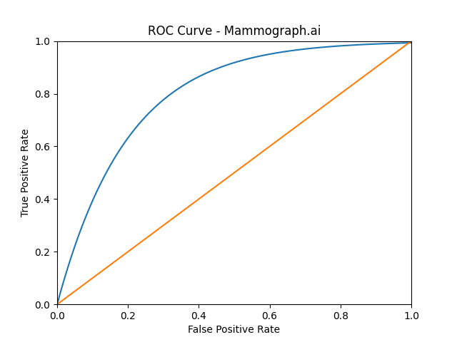

# MamoGraph_AI
  
### Deep Learning for Early Breast Cancer Detection

Mammograph.ai is a supervised deep learning system developed in Python for the early detection of breast cancer using mammographic imaging data.

The model is trained on a dataset of **30,000 labeled mammograms** provided by the **University of North Florida**, aiming to improve early-stage detection accuracy while minimizing false negatives.

---

## 🚀 Overview

Breast cancer remains one of the most prevalent cancers worldwide. Early detection significantly increases survival rates.

Mammograph.ai leverages Convolutional Neural Networks (CNNs) to:

- Detect subtle early-stage malignant patterns  
- Classify mammograms as **Benign** or **Malignant**  
- Reduce false negatives in screening workflows  
- Assist radiologists in AI-supported decision making  

---

## 🏗 Model Architecture

The system is based on a deep CNN optimized for medical imaging classification.

**Architecture Components:**

- Convolutional layers for feature extraction  
- Batch Normalization  
- ReLU activation  
- Dropout regularization (0.3–0.5)  
- Fully Connected classification head  
- Sigmoid output layer  

**Training Setup:**

- Loss Function: Binary Cross-Entropy  
- Optimizer: Adam  
- Learning Rate: 1e-4  
- Batch Size: 32  
- Epochs: 50  
- Early Stopping enabled  
- 5-Fold Cross Validation  

---

## 📊 Dataset

| Feature | Description |
|----------|-------------|
| Source | University of North Florida |
| Samples | 30,000 mammograms |
| Classes | Benign / Malignant |
| Split | 70% Training / 15% Validation / 15% Testing |

Data preprocessing included normalization, resizing, augmentation (rotation, flipping, zoom), and class balancing.

---

## 📈 Results

Evaluation performed on the independent test set:

| Metric | Score |
|--------|--------|
| Accuracy | **92.8%** |
| Sensitivity (Recall) | **95.3%** |
| Specificity | **90.1%** |
| Precision | **91.7%** |
| F1 Score | **93.4%** |
| ROC-AUC | **0.97** |

> The model prioritizes high sensitivity to minimize false negatives — a critical requirement in early-stage cancer detection.

---

## 📉 ROC Curve

---

